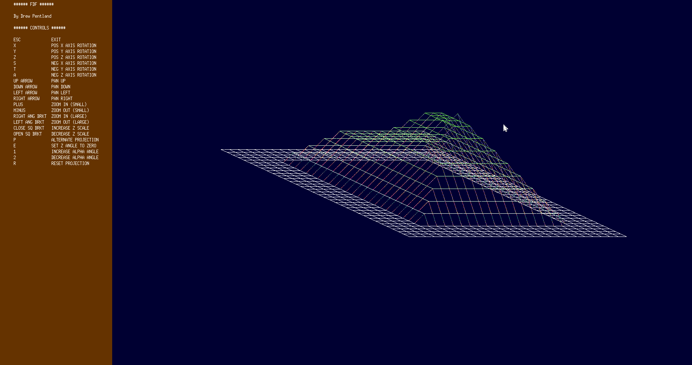

# FdF

`FdF` is a small C graphics project that turns a plain text height map into an
interactive 3D wireframe.



The input file is a grid of numbers. Each number becomes a point in space:
`x` and `y` come from the point's position in the grid, and `z` comes from the
number itself. The program projects those 3D points onto a 2D window, connects
neighboring points with lines, and lets the user rotate, pan, zoom, and reshape
the map in real time.

This was a solo school project for the 42 curriculum, completed over about one
month from May 2023 to June 2023. Final grade: `125/100`, including all bonus
features.

## What This Project Shows

FdF is an introduction to graphics programming without a game engine or high
level rendering framework. The project uses C, a Makefile, a custom utility
library (`libft`), and MiniLibX, a minimal windowing library used in the 42
curriculum.

The main implementation is in `fdf_working/`:

- `srcs/`: map parsing, rendering, projection math, line drawing, and input
  handling
- `includes/fdf.h`: shared structures, constants, key codes, and function
  declarations
- `libft/`: custom standard-library-style helpers used throughout the project
- `mlx/`: MiniLibX graphics library

Test maps and original project support files are kept in `fdf_42_files/` and
`fdf_testing/`.

## Build and Run

From the project implementation directory:

```sh
cd fdf_working
make
./fdf ../fdf_42_files/test_maps/42.fdf
```

This version is configured for Linux/X11 through MiniLibX. On a fresh system,
the usual MiniLibX dependencies are needed, including X11 development libraries.

## Controls

The program displays its controls in the left-side menu while running.

- `X`, `Y`, `Z`: rotate positively around each axis
- `S`, `T`, `A`: rotate negatively around each axis
- Arrow keys: pan the map
- `+` / `-`: small zoom in/out
- `<` / `>`: large zoom in/out
- `[` / `]`: adjust height scaling
- `P`: switch projection mode
- `1` / `2`: adjust the cabinet projection angle
- `E`: reset to a flat z-angle view
- `R`: reset projection
- `ESC`: exit

## Implementation Highlights

The challenging part of this project is that every stage is manual. The program
does not ask a graphics API to draw a 3D object. It parses the file, creates the
point cloud, transforms the points with matrix math, projects them into screen
coordinates, and writes pixels into an image buffer.

Notable pieces in this implementation:

- Highlights the use of linear algebra to manipulate coordinates in memory.
- Map parsing converts a rectangular `.fdf` file into a linked/array-backed list
  of 3D points.
- The renderer keeps the original map data intact and creates a transformed
  copy for each render, which makes repeated rotations and resets easier to
  reason about.
- Rotation around the `x`, `y`, and `z` axes is implemented with explicit 3x3
  matrices.
- Two projection styles are supported: the default orthographic/isometric-style
  view and an alternate cabinet projection.
- Lines are drawn into an off-screen image buffer instead of using one slow
  window call per pixel.
- Wireframe edges use a color gradient based on point height.
- The first render automatically scales the map to fit the window, which helps
  support both tiny sample maps and much larger terrain files.
- Bonus interaction support includes live rotation, zooming, panning, height
  scaling, projection switching, and reset views.

## Why This Is Hard For Students

For many students, FdF is the first project where memory management, file
parsing, math, graphics, and event handling all have to work at the same time.
A small bug in any one layer can show up as a blank window, distorted geometry,
crashes, or lines drawn in the wrong place.

The most demanding parts are usually:

- understanding how a 2D text grid becomes 3D coordinates
- keeping transformations centered around the map instead of the top-left corner
- writing correct rotation/projection math in C
- drawing lines pixel-by-pixel without leaving gaps or writing outside the image
  buffer
- making the map fit on screen for files of very different sizes
- freeing all allocated memory and MiniLibX resources cleanly on errors and exit

This project is intentionally small in scope, but it touches many of the same
ideas behind larger rendering systems: data loading, coordinate spaces,
projection, rasterization, buffering, and interactive controls.
